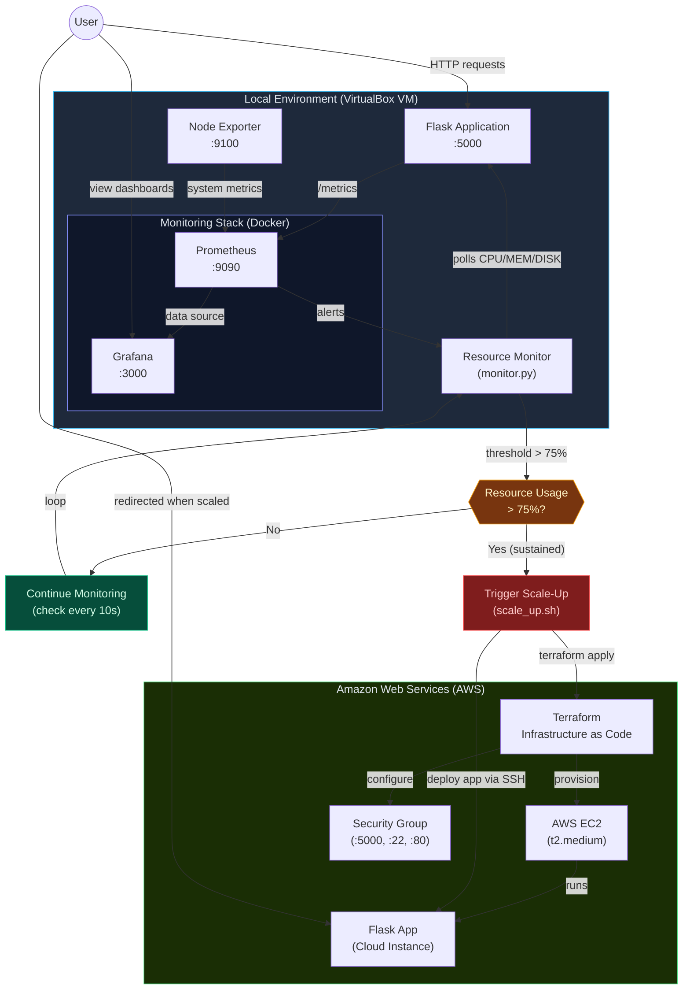
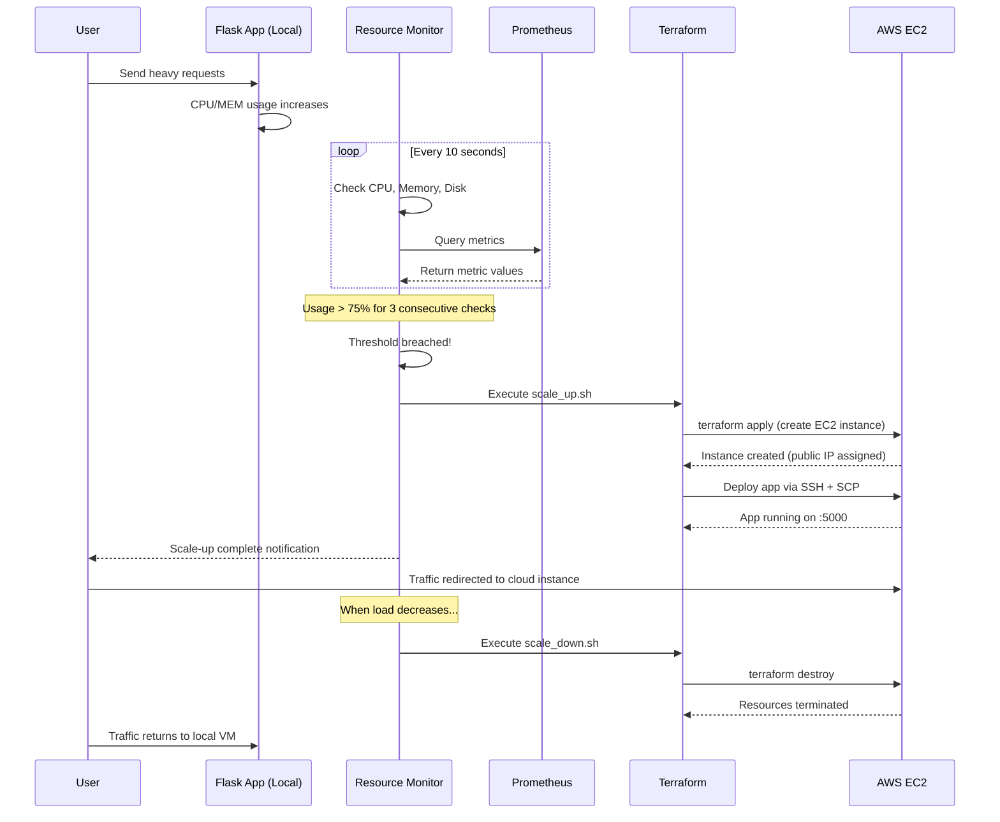

# Architecture Diagram

## System Architecture — Local VM to Cloud Auto-Scaling



## Sequence Diagram — Auto-Scaling Flow



## Component Diagram

```
┌─────────────────────────────────────────────────────────────────────────┐
│ LOCAL VM (VirtualBox) │
│ │
│ ┌──────────────┐ ┌──────────────┐ ┌──────────────────────────────┐ │
│ │ Flask App │ │ Node Exporter│ │ Resource Monitor │ │
│ │ (Port 5000) │ │ (Port 9100) │ │ (monitor.py) │ │
│ │ │ │ │ │ │ │
│ │ /metrics ────┼──┼──► Prometheus│ │ • Polls CPU/MEM/DISK │ │
│ │ /api/status │ │ (Port 9090) │ • 75% threshold check │ │
│ │ /api/load │ │ │ │ • Sustained breach = scale │ │
│ └──────────────┘ │ ──► Grafana │ │ • 5min cooldown │ │
│ │ (Port 3000) │ │ │
│ └──────────────┘ └──────────┬───────────────────┘ │
│ │ │
└───────────────────────────────────────────────────┼─────────────────────┘
│
┌─────────▼─────────┐
│ Threshold > 75% │
│ for 3 checks? │
└────────┬──────────┘
│ YES
┌────────▼──────────┐
│ scale_up.sh │
│ (Terraform + │
│ AWS CLI) │
└────────┬──────────┘
│
┌──────────────────────────────────────────────────┼──────────────────────┐
│ AMAZON WEB SERVICES (AWS) │ │
│ ▼ │
│ ┌──────────────┐ ┌──────────────┐ ┌──────────────────────────────┐ │
│ │ Security │ │ EC2 │ │ Flask App (Deployed) │ │
│ │ Group │──│ Instance │──│ (Port 5000) │ │
│ │ :5000,:22 │ │ t2.medium │ │ gunicorn + 4 workers │ │
│ └──────────────┘ └──────────────┘ └──────────────────────────────┘ │
│ │
└─────────────────────────────────────────────────────────────────────────┘
```